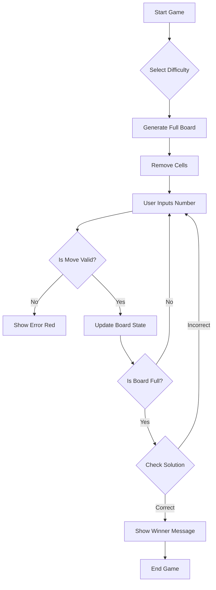

# Project Activities and UML Activity Diagram

This document tracks the development phases and the logical flow of the Sudoku application.

## 1. UML Activity Diagram

The following diagram represents the core logic for the game loop and board generation.

## 2. Project Activity Log

| Phase | Description | Status |
|-------|-------------|--------|
| **Phase 1: Planning** | Requirement analysis, architecture definition (MVC), and GitFlow setup. | Completed |
| **Phase 2: UI Design** | Creation of the Welcome Screen and the 9x9 Sudoku grid using Java Swing. | Completed |
| **Phase 3: Core Logic** | Implementation of the Sudoku model, move validation, and difficulty management. | Completed |
| **Phase 4: Algorithms** | Implementation of Backtracking solver and Sudoku generator service. | Completed |
| **Phase 5: Quality & CI/CD** | Unit testing with JUnit 5 and GitHub Actions workflow configuration. | Completed |
| **Phase 6: Documentation** | Creation of ARCHITECTURE.md, GITFLOW.md, and Javadoc generation. | Completed |
