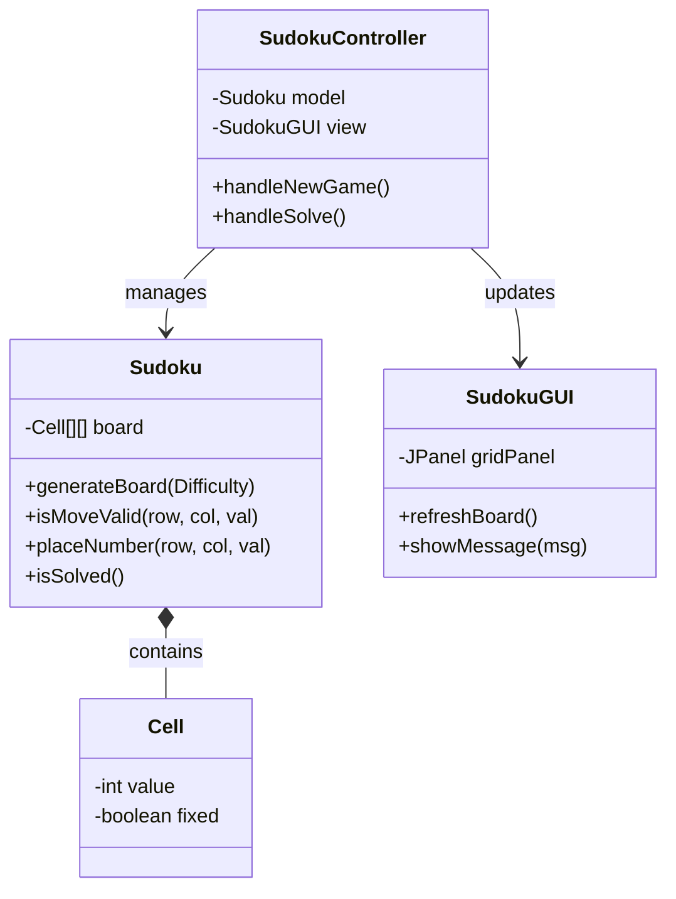
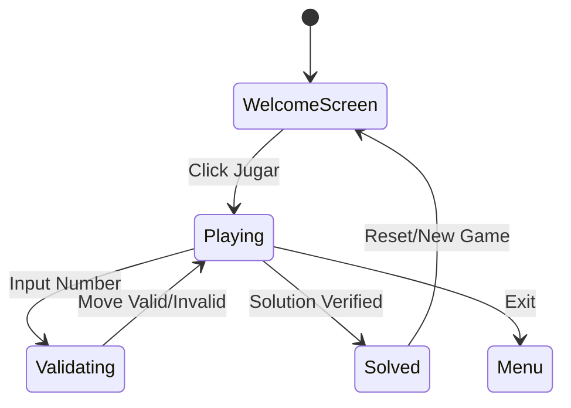
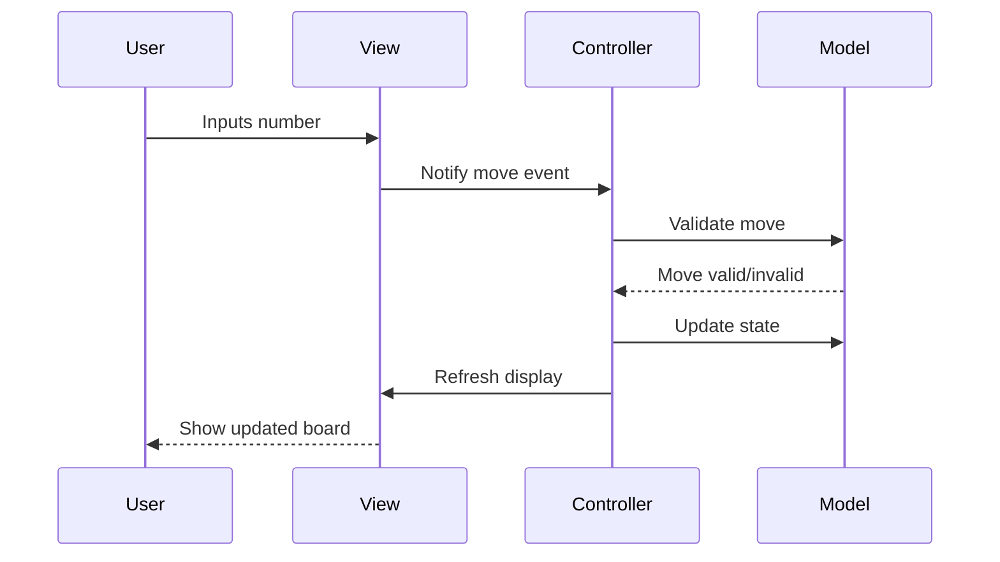

This document explains the technical architecture and the evolutionary design process of the Sudoku project.

## Design Evolution

The project evolved through several architectural stages:
1.  **Skeleton Phase**: Definition of empty classes to establish the MVC structure without business logic.
2.  **Logic Phase**: Transition from simple primitive arrays (`int[][]`) to a more robust `Cell` object model to handle state (fixed vs. editable).
3.  **UI Evolution**: Implementation of a single-frame GUI that eventually adopted `CardLayout` to support a professional Welcome Screen and decoupled game panels.
4.  **Service Integration**: Moving complex algorithms (Backtracking) out of the Model and into dedicated `Service` classes to follow the Single Responsibility Principle.

## MVC Pattern

The project follows the **Model-View-Controller** pattern to ensure modularity and ease of maintenance.

### Model
- **Location**: `src/main/java/com/sudoku/model`
- **Responsibility**: Manages game data, board state, and Sudoku rules.

### View
- **Location**: `src/main/java/com/sudoku/view`
- **Responsibility**: Handles user interface using Java Swing. No business logic.

### Controller
- **Location**: `src/main/java/com/sudoku/controller`
- **Responsibility**: Listens to user events from the View, updates the Model, and refreshes the View.

## Class Diagram

## State Diagram (Application States)

## Flow Diagram (MVC)

